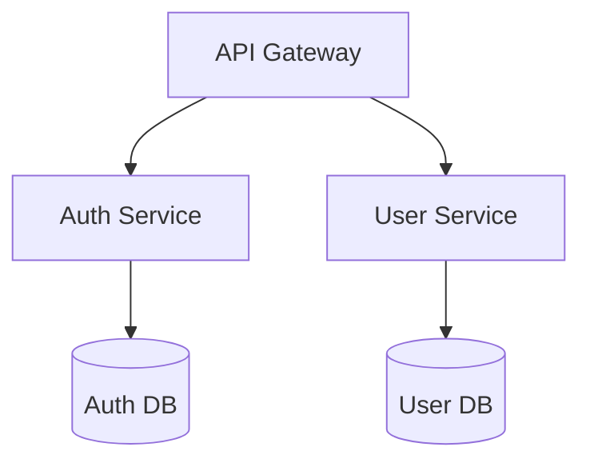

# Integrations

## GitHub API Integration

PR descriptions, issue references, and review comments are rich sources of "why" documentation. The GitHub analyzer will:
- Pull PR descriptions for ADR inference (large refactors, dependency changes)
- Extract linked issues for context on why changes were made
- Read review comments for architectural discussion threads
- Support GitHub Enterprise via configurable base URL
- Degrade gracefully — if no GitHub token is configured, fall back to git-only analysis
- Use `GITHUB_TOKEN` env var or `gh auth` token (same as GitHub CLI)

## Monorepo Strategy

For monorepos, we generate:
1. **Root-level unified docs** — `ARCHITECTURE.md` showing how packages relate, shared conventions, deployment topology, the "map" of the system
2. **Per-package docs** — each package gets its own `README.md`, `API.md`, etc. scoped to that package
3. **Cross-reference links** — per-package docs link to related packages; root doc links down to packages

Detection: if we find a `workspaces` field in `package.json`, a `pnpm-workspace.yaml`, a `lerna.json`, a Cargo workspace, or a Go workspace, we switch to monorepo mode automatically. Users can also force it in config.

```yaml
# .livindocs.yml — monorepo config
monorepo:
  enabled: auto  # auto | true | false
  packages:
    - packages/*
    - apps/*
  unified_docs: true            # generate root-level architecture doc
  per_package_docs: true         # generate docs inside each package
  cross_references: true         # link between package docs
```

## Custom Analyzers: Plugin System

Users can write custom analyzers and drop them into `.livindocs/analyzers/`. Each analyzer is a single TypeScript/JavaScript file that exports a standard interface:

```typescript
// .livindocs/analyzers/my-custom-analyzer.ts
import { Analyzer, AnalysisResult, FileContext } from '@livindocs/sdk';

export default class MyCustomAnalyzer implements Analyzer {
  name = 'my-custom-analyzer';
  description = 'Analyzes our internal RPC framework conventions';

  // Which files this analyzer cares about
  fileFilter(path: string): boolean {
    return path.endsWith('.rpc.ts');
  }

  async analyze(files: FileContext[]): Promise<AnalysisResult> {
    // Custom analysis logic
    return {
      type: 'custom',
      name: this.name,
      confidence: 0.85,
      data: { /* your structured findings */ },
      metadata: { filesAnalyzed: files.length, analyzedAt: new Date().toISOString() }
    };
  }
}
```

Custom analyzers run alongside built-in analyzers and their results are injected into the `ProjectContext`. Custom generators can also be registered to produce additional doc types from custom analysis data.

## CI/CD Integration

The plugin should work both interactively in Claude Code AND in CI pipelines.

### GitHub Actions

```yaml
# .github/workflows/docs-check.yml
name: Documentation Freshness Check
on:
  pull_request:
    branches: [main]

jobs:
  docs-check:
    runs-on: ubuntu-latest
    steps:
      - uses: actions/checkout@v4
        with:
          fetch-depth: 0  # Full history for git analysis
      - uses: livindocs/action@v1
        with:
          command: check
          config: .livindocs.yml
          github-token: ${{ secrets.GITHUB_TOKEN }}
          fail-on: stale  # Fail PR if docs are stale
```

### GitLab CI
```yaml
docs-check:
  stage: validate
  script:
    - npx @livindocs/cli check --fail-on stale
  only:
    - merge_requests
```

### CI Modes
- `check` — read-only, reports staleness, exits non-zero if stale (for PR gates)
- `update --dry-run` — shows what would change without writing (for PR comments)
- `update --commit` — updates docs and commits (for automated doc maintenance bots)

## Diagram Generation

We generate Mermaid diagrams embedded in Markdown for visual documentation.

### Diagram types
- **Module dependency graph** — which modules import from which
- **Data flow diagram** — how data moves through the system (API -> service -> database)
- **API route map** — HTTP endpoints organized by resource
- **Package relationship diagram** (monorepos) — how packages depend on each other
- **Deployment topology** — if infra config is detected (Docker, K8s, Terraform)

### Format
Mermaid renders natively in GitHub, GitLab, Notion, and most doc sites. We embed as fenced code blocks:
````markdown

````

For users who need static images (e.g., for PDFs), we can optionally render Mermaid to SVG/PNG using `@mermaid-js/mermaid-cli` as a post-processing step.

## Versioned Documentation

For projects that maintain multiple release branches, we support versioned docs.

```yaml
# .livindocs.yml
versioning:
  enabled: true
  strategy: git-tag    # git-tag | branch | manual
  current: main
  versions:
    - tag: v2.x
      branch: release/2.x
    - tag: v1.x
      branch: release/1.x
```

When versioning is enabled:
- Docs are generated into `docs/{version}/` subdirectories
- A version switcher is included in the root docs
- Staleness checks are scoped to the current branch

## Telemetry (Opt-in Only)

We want to understand how the tool is used to improve it, but privacy is non-negotiable.

### What we collect (only if opted in)
- Command usage counts (which commands are popular)
- Language/framework distribution (what ecosystems to prioritize)
- Repo size bucket (small/medium/large — never actual file paths or content)
- Error types (to fix bugs)

### What we never collect
- Source code, file names, file paths, or any content
- Git history, commit messages, or author information
- API keys, tokens, or secrets
- Anything that could identify the user or their project

### Implementation
```yaml
# .livindocs.yml
telemetry:
  enabled: false  # Default OFF — must be explicitly opted in
  anonymous_id: true  # If enabled, uses a random UUID, not user identity
```

First run of `/docs init` asks once: "Help improve livindocs by sharing anonymous usage stats? (y/N)". Default is no. Respects `DO_NOT_TRACK` env var.

## Competitive Positioning

### What makes livindocs different from existing tools

| Feature | livindocs | Swimm | Mintlify | JSDoc/Sphinx |
|---|---|---|---|---|
| Architecture docs | Auto-generated | Manual | Manual | Manual |
| ADRs from git history | Yes | No | No | No |
| Semantic staleness detection | Yes | Snippet-level | No | No |
| Onboarding guides | Auto-generated | Manual | No | No |
| API docs with examples | Yes | No | Yes | From comments |
| Monorepo support | Unified + per-package | Partial | Partial | No |
| Custom analyzers | Plugin system | No | No | Extensions |
| Open source | MIT | Proprietary | Proprietary | Yes |
| Cost | Free (bring your API key) | $$$$ | $$$ | Free |
| Vendor lock-in | None (plain Markdown) | High | Medium | Low |
| CI integration | Yes | Yes | Yes | Partial |
| Mermaid diagrams | Auto-generated | No | No | No |

### Our moat
1. **Claude's reasoning** — no other tool can infer architectural intent, not just parse syntax
2. **Open source + free** — Swimm charges per-seat, Mintlify charges per-project
3. **Breadth of output** — one tool generates READMEs, architecture docs, ADRs, onboarding guides, API refs, and changelogs
4. **Non-destructive updates** — marker system lets humans and AI co-author docs
5. **Custom analyzers** — extensible for proprietary frameworks and internal conventions
